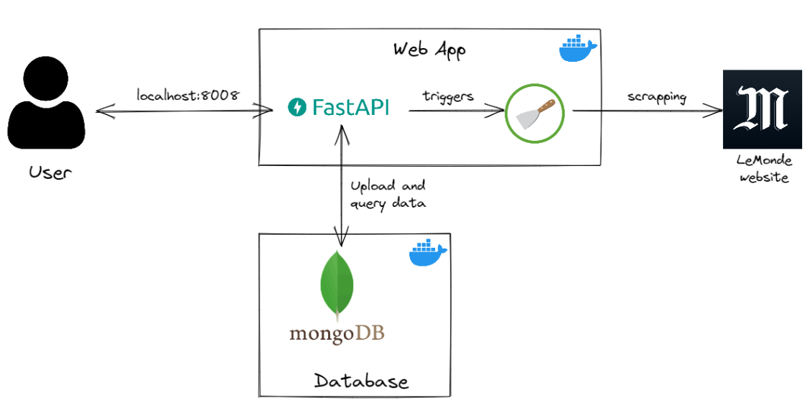

# Little Big Code technical challenge

Articles collect from **LeMonde**.

Author: Nicolas JULLIEN

This app have two main functionalities. The first one is to allow scrapping of the `LeMonde` website to collect the latest news thanks to an api endpoint. The second one provides two endpoints to retrieve a number of articles on one side and to retrieve a specific article with its URL on the other side.

## App schema



## Prerequisits

To run the app, [`docker`](https://docs.docker.com/engine/install/) must be locally installed.

`make` must be also installed. To install make in a Linux environment :
```
sudo apt-get install build-essential
```

## Run the app

To run the app, simply execute the following command:

```
make start
```

## Usage

### Access swagger

Once the app is running, it is possible to accès swagger at the following url:

**localhost:8008/docs**

### Scrapping articles

There are two sections: `Scrapper` and `Api`.

`Scrapper` section has an endpoint, called *Retrieve Articles*, which permits the scrapping of articles data from Le Monde website. The articles are stored in a MongoDB database.

A simple call on this endpoint triggers the articles scrapping.

### Retrieve article(s)

`Api` section has two different endpoints. The first one, *Articles*, enables the retrieval of multiple articles info from the database. The second one, *Article*, retruns the specific article infos from its URL, given in query parameter.

*Articles* offers a `skip` and `limit` query parameters to navigate easily amongst the different articles.

*Article* accepts only the `url` paramter to return the right article infos.

## Database

The database is a NoSQL MongoDB.

The articles documents are as follows:
```
{
    "id": "64430ee2d428a052f1223d13",
    "title": "Ligue 1 : petite victoire pour le PSG à Angers, mais grand pas vers le titre",
    "url": "https://www.lemonde.fr/sport/article/2023/04/22/ligue-1-petite-victoire-pour-le-psg-a-angers-mais-grand-pas-vers-le-titre_6170550_3242.html",
    "author": "Le Monde avec AFP",
    "description": "Le leader du championnat s’est imposé 2-1 chez la lanterne rouge grâce à un doublé de Kylian Mbappé. Les Parisiens comptent 11 points d’avance sur Marseille qui se déplace à Lyon, dimanche.",
    "publication_date": "2023-04-21T00:19:00",
    "creation_date": "2023-04-21T22:32:02.376000"
}
```
All the data except for `creation_date` is direclty collected from LeMonde website.
`creation_date` is the datetime corresponding to the moment the article document has been registred into the database.

## Self assessment

### Translate this app into production

This app, at production scale, could be put in the cloud. For instance, docker containers can be orchestrated by a kubernetes cluster and the mondoDB database can be moved to a NoSQL cloud database. Also, the scrappy part could have its own app instead of being inside the webapp.

### Limitations

The app suffers from the scrapping part being inside the webapp part. The scrapping process has to be executed synchronously with the webapp to respond the user's execution launch request. 

### Any improvment

As said earlier, the scrapping part must be separated from the webapp to be a whole process on its own. The best practices lead the developer to this kind of architecture.

### What about distributed data processing

To use distributed data processing could be a huge advantage in terms of computation speed and robustness to the increasing loads. Moreover, the scrapping, API and database processes can be parallelized to optimize runtime and availability.
